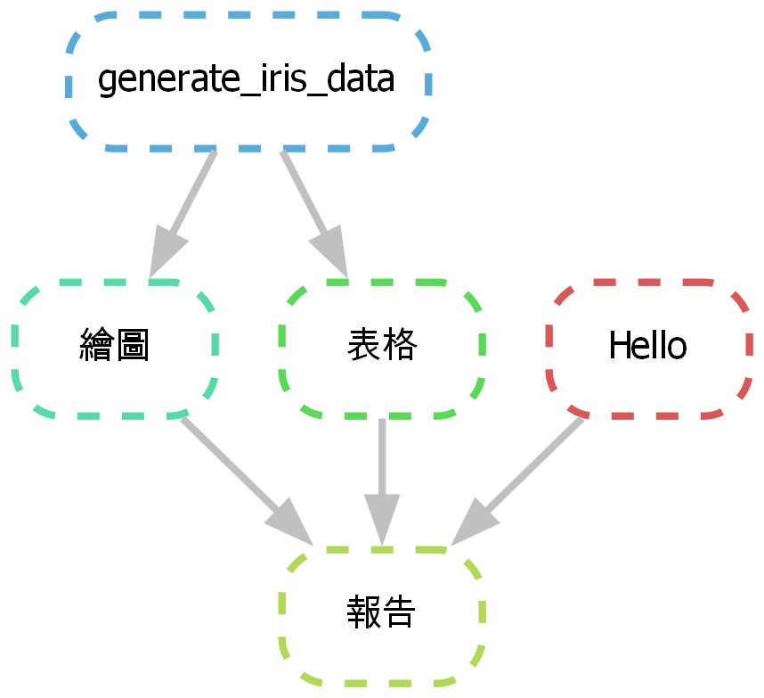

An example of a reproducible workflow with Snakemake
====================================================

This is my first experience with [Snakemake][sn].
See `./Snakefile` for the workflow. Run `bash make.sh`
to reproduce everything. 

- [The Final Report](https://yongfu.name/Snake/report.html)

## Snakemake

I have tried [GNU Make](https://www.gnu.org/software/make)
for my work to enhance reproducibility and automation
but got stuck with Chinese character issues on GNU Make 
built for Windows. So I tried [Snakemake][sn] and it looks 
pretty good! It is based on Python so fewer cross-platform 
issues should arise. It can generate a 
[DAG](https://en.wikipedia.org/wiki/Directed_acyclic_graph) 
for visualizing dependencies between defined workflows, which 
is pretty cool!

### Resources

#### Quick Start

- [Snakemake Website][sn]
- [A YouTube demo of Snakemake][yt]

[sn]: https://snakemake.github.io
[yt]: https://www.youtube.com/watch?v=r9PWnEmz_tc

#### Docs I find useful

- [Tutorial][tutorial]
    - [Config][config]
    - [Logging][log]
    - [The `script` tag][script]
    - [Sub-workflows][subworkflow]
- [Recommended directory structure][dir-struct]
- [A not-so-minor bug][unexpected-behavior]

[config]: https://snakemake.readthedocs.io/en/stable/tutorial/advanced.html#step-2-config-files
[log]: https://snakemake.readthedocs.io/en/stable/tutorial/advanced.html#step-5-logging
[script]: https://snakemake.readthedocs.io/en/stable/tutorial/basics.html#step-6-using-custom-scripts
[subworkflow]: https://snakemake.readthedocs.io/en/stable/snakefiles/modularization.html#snakefiles-sub-workflows
[dir-struct]: https://snakemake.readthedocs.io/en/stable/snakefiles/deployment.html#distribution-and-reproducibility
[unexpected-behavior]: https://github.com/snakemake/snakemake/issues/2011
[tutorial]: https://snakemake.readthedocs.io/en/stable/tutorial/tutorial.html